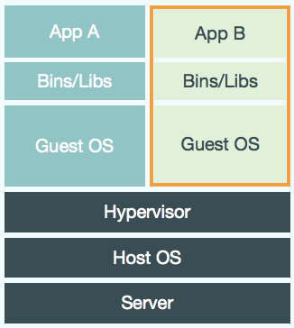
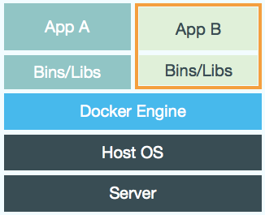
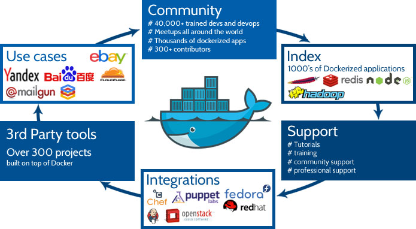
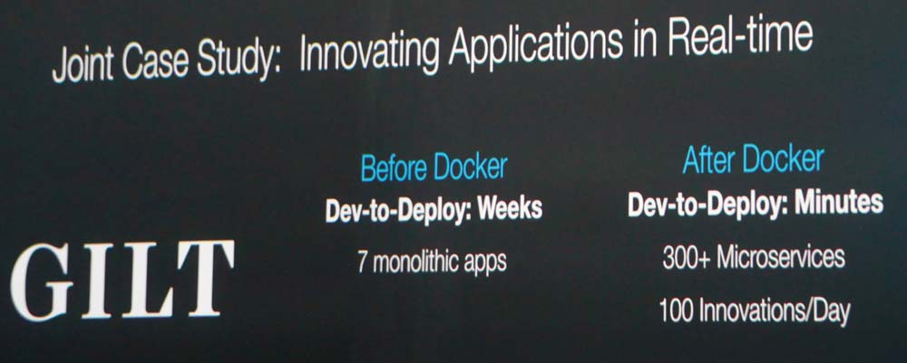

# [fit] Docker


---

# Ich


[@chassing](https://twitter.com/chassing)
[github.com/chassing](https://github.com/chassing)
[github.com/opendevmeet](https://github.com/opendevmeet/)

---

# Was ist docker?

docker.com

 

---

# Was ist es noch?



[Hub](https://registry.hub.docker.com) Community Company

---

# Use Cases

  



 

---

# Hello World Dockerfile

```ini
FROM ubuntu
CMD echo "This is a test." | wc -
```

---

# Dockerfile

```ini
FROM php:5.6-apache

RUN a2enmod rewrite

RUN rm -rf /var/www/html && mkdir /var/www/html
VOLUME /var/www/html
WORKDIR /var/www/html

ENV WORDPRESS_VERSION 4.0.0
ENV WORDPRESS_UPSTREAM_VERSION 4.0

# upstream tarballs include ./wordpress/ so this gives us /usr/src/wordpress
RUN curl -SL http://wordpress.org/wordpress-${WORDPRESS_UPSTREAM_VERSION}.tar.gz | tar -xzC /usr/src/

COPY docker-entrypoint.sh /entrypoint.sh

ENTRYPOINT ["/entrypoint.sh"]
EXPOSE 80
CMD ["apache2", "-DFOREGROUND"]
````

---


# Did you say more power?

---

# FIG

```
db:
  image: postgres
  ports:
    - "5432:5432"
web:
  build: .
  command: python manage.py runserver 0.0.0.0:8000
  volumes:
    - .:/code
  ports:
    - "8000:8000"
  links:
    - db
```
___

# Fragen vor der Demo?


---

# [fit] Demo


---

# Moar!


[Docker Präsentation](http://de.slideshare.net/dotCloud/docker-resentation-meetupparis?qid=89013861-ae40-4611-a24d-440fffb6098e&v=default&b=&from_search=8)
[DB migrations mit docker](http://blog.mathieu-leplatre.info/use-docker-to-ease-database-schema-migrations.html)
[Running GUI apps with docker](http://fabiorehm.com/blog/2014/09/11/running-gui-apps-with-docker/)
[Jenkins Docker Image](https://registry.hub.docker.com/_/jenkins/)

---

# Grafiken + Quellen

Alles "gestohlen" :wink: von:

[docker.com](https://www.docker.com/whatisdocker/)
[blog.docker.com](https://blog.docker.com/)
[heise.de](http://www.heise.de/newsticker/meldung/Amazon-Lambda-Anwendungen-ohne-Infrastruktur-2456963.html?wt_mc=rss.ho.beitrag.rdf)
[http://www.solvencyiinews.com](http://www.solvencyiinews.com)
[http://gobeyondseo.com](http://gobeyondseo.com)
